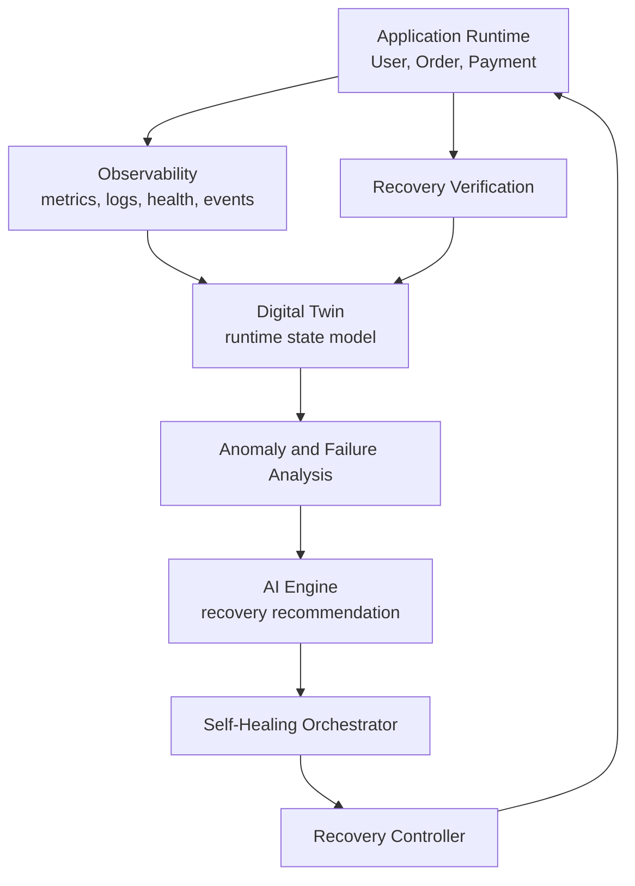

# AI-Based Self-Healing System Using a Digital Twin

An incremental microservices project for demonstrating how an application can be monitored, represented by a digital twin, diagnosed when failures occur, and recovered through controlled actions.

This README is the primary project guide. It describes the running Phase 1 implementation and separates it from capabilities planned for later phases.

## Project status

**Phase 1 is implemented.** It provides a containerized User, Order, and Payment application with service-to-service requests, basic health endpoints, and development-only failure injection.

Prometheus/Grafana observability, the digital twin, anomaly and root-cause analysis, AI-based recovery selection, and automated recovery are not implemented yet.

## Contents

- [Goals and scope](#goals-and-scope)
- [System design](#system-design)
- [Phase 1 architecture](#phase-1-architecture)
- [Technology stack and dependencies](#technology-stack-and-dependencies)
- [Requirements](#requirements)
- [Run the application](#run-the-application)
- [Service API reference](#service-api-reference)
- [Order flow example](#order-flow-example)
- [Failure injection](#failure-injection)
- [Configuration](#configuration)
- [Repository layout](#repository-layout)
- [Security and development notes](#security-and-development-notes)
- [Known limitations](#known-limitations)
- [Roadmap](#roadmap)

## Goals and scope

The project explores a self-healing loop for a microservices application:

1. Observe services and collect runtime signals.
2. Maintain a digital representation of the application's current state.
3. Detect abnormal behavior and identify likely causes.
4. Select and evaluate a recovery action.
5. Apply the action to the application and confirm whether it worked.
6. Feed the outcome back into the digital twin and continue monitoring.

Phase 1 supplies the application being observed and a controlled way to introduce failures. The later phases will add the monitoring, modeling, decision, and recovery components.

## System design

### Current Phase 1 request flow

```mermaid
flowchart LR
    Client[Client] -->|POST /orders| Order[Order Service :8002]
    Order -->|GET /users/{user_id}| User[User Service :8001]
    Order -->|POST /payments| Payment[Payment Service :8003]
    Order -->|Order result| Client
```

All three services run as separate Uvicorn processes in Docker containers. Docker Compose puts them on a private application network and publishes their HTTP ports to the host for local use.

### Target self-healing design



This is the planned design, not the current implementation. Phase 1 does not contain a digital twin or automated recovery engine.

### Component responsibilities

| Component | Current responsibility |
| --- | --- |
| User Service | Returns details for a small set of seeded users. |
| Order Service | Validates the requested user, calls Payment, and returns a confirmed order response. |
| Payment Service | Simulates payment authorization and returns a transaction identifier. |
| Shared failure controller | Deliberately injects unavailable, server-error, or slow responses for local demonstrations. |
| Docker Compose | Builds and starts each service as an independent container. |

## Phase 1 architecture

### User Service

- Host port: `8001`
- Container port: `8000`
- `GET /users/{user_id}` returns a seeded user's id, name, and email.
- `GET /health` returns the service's basic health status.
- User records are held in process memory and reset when the container restarts.

### Order Service

- Host port: `8002`
- Container port: `8000`
- `POST /orders` accepts a user id, item name, and positive amount.
- It looks up the user through the User Service, then requests authorization from Payment.
- On success it returns a generated order id, payment transaction id, and `confirmed` status.
- Service URLs are configurable through `USER_SERVICE_URL` and `PAYMENT_SERVICE_URL`.
- Outbound HTTP requests use HTTPX with a five-second timeout.

### Payment Service

- Host port: `8003`
- Container port: `8000`
- `POST /payments` accepts a user id and positive amount.
- It simulates authorization and returns a generated transaction id.
- It does not connect to a real payment provider or persist transactions.

### Failure controller

Each service has a local failure controller. When enabled, it intercepts application requests and can return HTTP 503, return HTTP 500, or delay the request. The `/admin/failure` control routes remain available while a failure is enabled so it can be turned off again.

The health routes pass through this middleware. They return a simple service response when no failure is active; they are not a complete dependency-aware readiness check.

## Technology stack and dependencies

| Technology | Version / role |
| --- | --- |
| Python | 3.12, application language and runtime image. |
| FastAPI | `0.116.1`, asynchronous HTTP API framework and request validation. |
| Pydantic | Request and response models; installed as a FastAPI dependency. |
| Uvicorn | `0.35.0` with standard extras, ASGI server for each service. |
| HTTPX | `0.28.1`, asynchronous HTTP client used by Order to call User and Payment. |
| Docker | Packages each service into a container. |
| Docker Compose | Builds, networks, configures, and starts the local service stack. |

The pinned Python dependencies are listed in [`requirements.txt`](requirements.txt). FastAPI brings in Starlette for ASGI middleware and Pydantic for data validation. The service containers use the root [`Dockerfile`](Dockerfile) and each runs a different application module through its Compose command.

### Planned dependencies and tools

These are the proposed additions for later phases; they are not installed in the Phase 1 environment yet. Versions will be pinned when each phase is implemented and validated.

| Phase | Planned dependency / tool | Purpose |
| --- | --- | --- |
| 2 | `prometheus-client` and Prometheus | Expose and scrape application metrics. |
| 2 | Grafana | Build dashboards for service health, latency, errors, and recovery results. |
| 2 | OpenTelemetry Python SDK and OTLP exporter (optional) | Add consistent traces and telemetry correlation across service calls. |
| 3 | PostgreSQL with a Python database driver | Persist digital-twin state and service/dependency history. The schema and ORM choice remain open. |
| 4 | `scikit-learn` (candidate) | Establish a baseline for statistical anomaly detection before evaluating more complex models. |
| 5 | AI model/provider integration (to be selected) | Analyze failure context and recommend recovery actions. Provider selection should follow an evaluation of quality, latency, cost, and deployment constraints. |
| 6–7 | Recovery adapter for the chosen runtime | Execute and verify controlled recovery operations. The initial local demo can target Docker Compose; production runtime support is not selected. |

The project will keep these as separate services or adapters where practical, so monitoring, state storage, model choice, and recovery tooling can evolve without changing the core order flow.

## Requirements

- Docker Engine or Docker Desktop with the Docker Compose plugin.
- `curl` or another HTTP client for the examples below.

Python does not need to be installed on the host when using Docker Compose.

## Run the application

Run these commands from the project root:

```bash
docker compose up --build
```

The interactive API documentation for each service is available at:

- User: <http://localhost:8001/docs>
- Order: <http://localhost:8002/docs>
- Payment: <http://localhost:8003/docs>

Each OpenAPI schema is also available at `/openapi.json` on its service port. Stop the containers with `Ctrl+C`, then remove them with:

```bash
docker compose down
```

To rebuild after changing application code, run `docker compose up --build` again.

## Service API reference

### User Service (`localhost:8001`)

| Method and path | Behavior |
| --- | --- |
| `GET /health` | Returns the service name and `healthy` status when not being fault-injected. |
| `GET /users/{user_id}` | Returns a seeded user or HTTP 404 if the id is unknown. |
| `GET /admin/failure` | Returns the active failure-injection configuration. |
| `POST /admin/failure` | Sets the failure-injection configuration. |

Seeded ids are `user-1` and `user-2`.

### Order Service (`localhost:8002`)

| Method and path | Behavior |
| --- | --- |
| `GET /health` | Returns the service name and `healthy` status when not being fault-injected. |
| `POST /orders` | Validates the user and requests payment authorization. Returns HTTP 201 on success. |
| `GET /admin/failure` | Returns the active failure-injection configuration. |
| `POST /admin/failure` | Sets the failure-injection configuration. |

Order request body:

```json
{
  "user_id": "user-1",
  "item": "Wireless Mouse",
  "amount": 799
}
```

The item must contain 1–120 characters, and amount must be greater than zero.

### Payment Service (`localhost:8003`)

| Method and path | Behavior |
| --- | --- |
| `GET /health` | Returns the service name and `healthy` status when not being fault-injected. |
| `POST /payments` | Simulates authorization and returns HTTP 201 with a transaction id. |
| `GET /admin/failure` | Returns the active failure-injection configuration. |
| `POST /admin/failure` | Sets the failure-injection configuration. |

Payment request body:

```json
{
  "user_id": "user-1",
  "amount": 799
}
```

### Typical error responses

- Unknown user: HTTP 404 from Order.
- Invalid request fields: HTTP 422 from FastAPI validation.
- A downstream service returns an error: HTTP 502 from Order.
- A downstream service cannot be reached or times out: HTTP 502 from Order.
- A service with injected `unavailable` or `error` mode returns HTTP 503 or 500 respectively.

## Order flow example

Create an order for a seeded user:

```bash
curl -X POST http://localhost:8002/orders \
  -H 'Content-Type: application/json' \
  -d '{"user_id":"user-1","item":"Wireless Mouse","amount":799}'
```

The response has this shape; generated identifiers vary:

```json
{
  "order_id": "order-<generated-id>",
  "user_id": "user-1",
  "item": "Wireless Mouse",
  "amount": 799,
  "payment_transaction_id": "txn-<generated-id>",
  "status": "confirmed"
}
```

Order first calls `GET http://user-service:8000/users/{user_id}`. If the user exists, it calls `POST http://payment-service:8000/payments`. These DNS names are available between containers on the Compose network; host clients use the published ports instead.

## Failure injection

Failure controls are intended for local demonstrations and later recovery-engine integration. They are not protected by authentication and must not be exposed to an untrusted network.

Enable an HTTP 503 response from Payment:

```bash
curl -X POST http://localhost:8003/admin/failure \
  -H 'Content-Type: application/json' \
  -d '{"enabled":true,"mode":"unavailable"}'
```

Attempt an order while Payment is unavailable:

```bash
curl -i -X POST http://localhost:8002/orders \
  -H 'Content-Type: application/json' \
  -d '{"user_id":"user-1","item":"Wireless Mouse","amount":799}'
```

Restore Payment:

```bash
curl -X POST http://localhost:8003/admin/failure \
  -H 'Content-Type: application/json' \
  -d '{"enabled":false}'
```

Available modes:

| Mode | Effect |
| --- | --- |
| `unavailable` | Returns HTTP 503 for application routes. |
| `error` | Returns HTTP 500 for application routes. |
| `slow` | Delays application requests by `delay_seconds` before continuing. |

The default delay is five seconds; accepted values are from zero to 60 seconds. Read the current configuration using `GET /admin/failure` on the desired service.

## Configuration

| Variable | Used by | Default / Compose value |
| --- | --- | --- |
| `USER_SERVICE_URL` | Order Service | `http://localhost:8001` by default; Compose sets `http://user-service:8000`. |
| `PAYMENT_SERVICE_URL` | Order Service | `http://localhost:8003` by default; Compose sets `http://payment-service:8000`. |

Compose starts User and Payment before Order. This startup ordering does not guarantee that dependencies are ready to accept requests; retry and readiness orchestration are future improvements.

## Repository layout

```text
ai-based-self-healing/
├── .dockerignore
├── Dockerfile
├── README.md
├── docker-compose.yml
├── requirements.txt
└── services/
    ├── order/
    │   └── main.py
    ├── payment/
    │   └── main.py
    ├── shared/
    │   └── failure_control.py
    └── user/
        └── main.py
```

## Security and development notes

- The user records are sample data. Do not add real personal information.
- Payment authorization is simulated. No real payment provider is contacted.
- The `/admin/failure` endpoints have no authentication; keep them on a local development network.
- The services currently have no database, authentication, authorization, TLS setup, or production secret management.
- The containers are a development setup and should receive security hardening before deployment.

## Known limitations

- User data and service state are held in process memory; generated orders and payments are not persisted.
- The Payment Service always simulates authorization; it does not validate a payment method or contact a provider.
- Order uses synchronous dependency sequencing inside one request and has a fixed five-second outbound timeout.
- Health endpoints are simple responses and do not check downstream dependencies or external telemetry.
- There is no metrics pipeline, distributed tracing, digital twin, anomaly detection, AI engine, recovery orchestrator, or automated recovery controller in Phase 1.
- No automated test suite is currently included.

## Roadmap

1. **Phase 1 — Core architecture and initial microservices:** implemented in this repository.
2. **Phase 2 — Observability and health monitoring:** add Prometheus metrics and Grafana dashboards, plus useful health and dependency signals.
3. **Phase 3 — Digital Twin state model:** define the service, dependency, and runtime state representation and keep it synchronized with observations.
4. **Phase 4 — Failure and anomaly detection:** identify unhealthy and abnormal service behavior from telemetry.
5. **Phase 5 — AI Engine:** analyze state and recommend an appropriate recovery action with a reason.
6. **Phase 6 — Self-Healing Orchestrator:** coordinate diagnosis, decision, execution, and verification.
7. **Phase 7 — Recovery Controller:** apply approved recovery operations through controlled interfaces.
8. **Phase 8 — Feedback loop and recovery verification:** evaluate outcomes and update the digital twin.
9. **Phase 9 — Testing, evaluation, and final documentation:** add automated coverage and assess the completed system.
